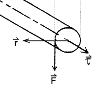
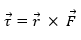
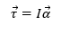

# THEORY
This experiment is an introduction to some basic components of rotational dynamics to develop an understanding of Moment of Inertia

## Torque and Mass Moment of Inertia
If a body is free to rotate about a fixed axis, then a torque is required to initiate or change the rotational motion of the body.

The torque τ ⃗  of a force about an axis is given by the cross-product of the force F  ⃗ and the distance from the axis of rotation

 

The net torque is proportional to the angular acceleration α ⃗ of the body and shall exist during the entire time the torque acts. The equation is given as

 

Where I is the constant of the body known as the Mass Moment of Inertia about the specified axis of rotation. Mass moment of inertia (also known as rotational inertia) is a measure of a body’s resistance to a change in its rotation direction or angular momentum. The moment of inertia depends not only on the mass but also the distribution of the mass around the axis. Just as the mass is a measure of resistance of linear acceleration, mass moment of inertia is a measure of resistance to angular acceleration.
## Flywheel
The experiment consists of estimating the mass moment of inertia of the flywheel system. A flywheel is a heavy thick circular discs designed for storing rotational energy. It is generally made of cast iron or steel along is mounted on an axle free to rotate on ball bearings. In other words, it’s a kind of system that needs a large force to start or stop spinning. The capacity of storing / shedding of kinetic energy depend on the rotational inertia of the flywheel.

In real life, flywheels come in all shapes and sizes. For obtaining the maximum moment of inertia per volume, most flywheels have a heavy outer circular rim with spokes. They may be mounted on the crankshaft of machines such as turbines, steam engines, diesel engines etc. This makes the engine run smoothly by storing kinetic energy when the machines are on higher loads and maintains that constant angular velocity during idle conditions.

## Mass Moment of Inertia of Flywheel
The Mass Moment of Inertia of cylindrical objects about an axis passing through the centre can be given by the equation

I =  (mr^2)/2.

The flywheel in this experiment is a solid disc of mass M1 and radius R attached to a shaft of mass M2 and radius r. So the moment of inertia of the flywheel system is given as 

I = Σ (mr^2)/2=  (M_1 R^2)/2+(M_2 r^2)/2

 
For complex geometries, the mass moment of Inertia of the flywheel can be estimated by measuring the approximate mass of different simplified geometrical components and adding the Mass Moment of Inertia about the central axis (from the known equations of MI of rings, cylinders, rods, etc).

## Experimental Setup and Theory
In the experiment, a hanging mass m attached to the end of a spring, the remainder of which is wrapped around the axle is allowed to fall initiating the necessary torque τ ⃗  to the flywheel system initially at rest. Suppose that the string is wrapped around the axle n times and that a mass m is suspended from its free end and the system is released at time t = 0. As the mass accelerates downward, the flywheel attains an angular acceleration α ⃗. Because of the friction in the bearings, there will be an additional torque in the direction opposite to the motion of the flywheel. This frictional torque (α_f ) ⃗ depends upon a number of factors such as speed of rotation, coefficient of friction, etc but shall be assumed to be a constant value for simplicity.

 
If T is the tension in the string, then the net torque exerted by the wheel is 

 
The net force on the mass m is

 
If the frictional torque is constant, then the angular acceleration of the system, (α_f ) ⃗, is also constant
The flywheel will achieve a maximum angular velocity at the instant when the string detaches from the axle. The axle will continue to rotate until all the work is used to overcome the friction in bearings. Finally, the axle will stop rotating against the frictional forces.

## Theoretical Calculations
As the slotted weight falls a particular height, it loses its potential energy. The loss in potential energy during unwinding is converted into its translation kinetic energy and rotational kinetic energy of flywheel. Some of the energy is lost in overcoming frictional forces in the bearings. 
Applying the law of conservation of energy at the instant the mass hits the ground.

(P.E)m = (R.K.E.)F + (L.K.E.)m + Frictional losses

The loss of potential energy (P.E)m of the slotted weights as it hits the ground is given as

(P.E)m = m g h = mg (2 π r n)

Note that we have neglected the thickness of the cord since radius of elastic cord cannot be determined experimentally. Another source of error is the slipping of the cord from the axle during unwinding. 

The rotational kinetic energy of the flywheel (R.K.E)f can be given by

(R.K.E.)m = ½ Iω^2

The gain in linear Kinetic Energy (L.K.E)m of the slotted weights just before the mass touches the ground is given as
(L.K.E.)m = ½ mv^2

If ω is the angular speed of the disc just as the mass hits the ground, then the final velocity of slotted weights is given by
v = rω

The frictional losses are mainly due to friction in the axle and bearing assembly of the apparatus. We assume that the bearing frictional losses per unit rotation to be a constant value Wf. The total bearing friction depends on the number of wounds of cord around the axle

Bearing friction at the end of n1 rotations = n Wf

It is worth mentioning that air friction acting on the surface of the rotating disc as well as the moving weights may also result in losses which are ignored here.

Applying the individual equations in the law of conservation of energy, we obtain
 
  Where, 	
  
          I	=	Moment of inertia of the flywheel assembly about its axis

          R	=	Radius of the axle

          ω	=	maximum angular velocity (just before detaching)

          m	=	total mass of the slotted weights

          n	=	Number of revolutions as the slotted weights falls the distance h = initial number of wounds of cord

          Wf	=	amount of work done per rotation against bearing friction 

          g	=	Acceleration due to gravity

          v	=	maximum velocity of slotted weights just before detaching 
  
  

Now, even after the mass detaches from the axle, the flywheel will continue to rotate. The angular velocity of the flywheel would decline gradually and finally come to a rest when all is rotational kinetic energy of flywheel (R.K.E)f is spent to overcome the frictional forces. If N is the number of rotation made by the flywheel after the string has left the axle then

 
 
Substituting the values of v and Wf in the equation,

 
Solving the equation for I, we obtain the following equation for mass moment of inertia of a flywheel which is,

 
The maximum angular velocity ω in the above equation can be found out by calculating the average velocity ωa as the flywheel comes to a final stop.

 
If N revolutions take a time t, then the average angular is given by

 
The above two equations give us a direct relationship between maximum angular velocity, number of rotations after detachment and the time required to complete that revolution

 
The experimental moment of inertia calculated by the equation may be slightly different from the theoretical moment of inertia because of the following criteria
	The thickness of the cord is assumed to be negligible.
	The bearing friction per rotation was assumed to be a constant value throughout the rotation.
	 The air frictional losses are ignored.
	Any slip between the cords and the axle during unwinding is ignored
  
  
