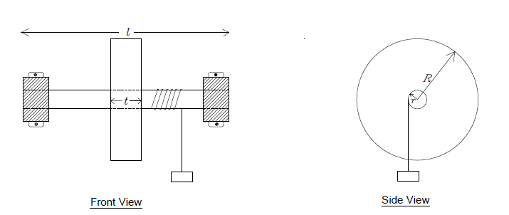

## Theory

### Torque and Mass Moment of Inertia

If a body is free to rotate about a fixed axis, then a torque is required to initiate or change the rotational motion of the body. The torque $\mathbf{\tau}$ of a force about an axis is given by the cross-product of the force $\mathbf{F}$ and the distance from the axis of rotation:

$$
\mathbf{\tau} = \mathbf{r \times F}
$$

The net torque is proportional to the angular acceleration $\alpha$ of the body and shall exist during the entire time the torque acts. The equation is given as:

$$
\mathbf{\tau} = \mathbf{I\alpha}
$$

where $\mathbf{I}$ is the constant of the body known as the **mass moment of inertia** about the specified axis of rotation. Mass moment of inertia (also known as rotational inertia) is a measure of a body's resistance to a change in its rotational direction or angular momentum. The moment of inertia depends not only on the mass but also on the distribution of the mass around the axis. Just as mass is a measure of resistance to linear acceleration, mass moment of inertia is a measure of resistance to angular acceleration.

### Flywheel

The experiment consists of estimating the mass moment of inertia of the flywheel system. A flywheel is a heavy, thick circular disc designed for storing rotational energy. It is generally made of cast iron or steel and is mounted on an axle free to rotate on ball bearings. In other words, it is a system that requires a large force to start or stop spinning. The capacity for storing and shedding kinetic energy depends on the rotational inertia of the flywheel.

In real life, flywheels come in all shapes and sizes. For obtaining the maximum moment of inertia per volume, most flywheels have a heavy outer circular rim with spokes. They may be mounted on the crankshaft of machines such as turbines, steam engines, and diesel engines. This allows the engine to run smoothly by storing kinetic energy when the machines are under higher loads and maintaining constant angular velocity during idle conditions.

### Mass Moment of Inertia of Flywheel

The mass moment of inertia of cylindrical objects about an axis passing through the center can be given by the equation:

$$
I = \frac{mr^{2}}{2}
$$

The flywheel in this experiment is a solid disc of mass $M_{1}$ and radius $R$ attached to a shaft of mass $M_{2}$ and radius $r$. The moment of inertia of the flywheel system is given as:

$$
I = \sum_{}^{}\ \frac{mr^{2}}{2} = \frac{M_{1}R^{2}}{2} + \frac{M_{2}r^{2}}{2}
$$

For complex geometries, the mass moment of inertia of the flywheel can be estimated by measuring the approximate mass of different simplified geometrical components and adding the mass moment of inertia about the central axis from the known equations of moment of inertia of rings, cylinders, rods, etc.

### Experimental Setup and Theory

In the experiment, a hanging mass $m$ attached to the end of a string (the remainder of which is wrapped around the axle) is allowed to fall, initiating the necessary torque $\tau$ to the flywheel system initially at rest. Suppose that the string is wrapped around the axle $N\_1$ times and a mass $m$ is suspended from its free end. The system is released at time $t = 0$. As the mass accelerates downward, the flywheel attains an angular acceleration $\alpha$. Because of the friction in the bearings, there will be an additional torque in the direction opposite to the motion of the flywheel. This frictional torque $\tau\_f$ depends upon a number of factors such as speed of rotation and coefficient of friction, but shall be assumed to be a constant value for simplicity.

If $T$ is the tension in the string, then the net torque exerted by the wheel is:

$$
\sum_{}^{} M = I\alpha
$$

$$
\tau_{r} - \tau_{f} = I\alpha
$$

The net force on the mass $m$ is:

$$
\sum_{}^{} F = ma
$$

$$
mg - T = ma
$$

If the frictional torque is constant, then the angular acceleration of the system, $\mathbf{\alpha}$, is also constant. The flywheel will achieve a maximum angular velocity at the instant when the string detaches from the axle. The axle will continue to rotate until all the work is used to overcome the friction in bearings. Finally, the axle will stop rotating against the frictional forces.

### Theoretical Calculations

#### Energy Conservation Principle

As the slotted weight falls a particular height, it loses its potential energy. The loss in potential energy during unwinding is converted into its translational kinetic energy and rotational kinetic energy of the flywheel. Some of the energy is lost in overcoming frictional forces in the bearings. Applying the law of conservation of energy at the instant the mass hits the ground (string detaches):

$$
(P.E)_{m} = (R.K.E.)_{f} + (L.K.E.)_{m} + \text{Frictional losses}
$$

#### Loss of Potential Energy

The loss of potential energy $(P.E)_{m}$ of the slotted weights as it hits the ground is given as:

$$
(P.E)_{m} = mgh = mg(2\pi rN_{1})
$$

Note that we have neglected the thickness of the cord since the radius of elastic cord cannot be determined experimentally. Another source of error is the slipping of the cord from the axle during unwinding.

#### Rotational Kinetic Energy of Flywheel

The rotational kinetic energy of the flywheel $(R.K.E.)_{f}$ can be given by:

$$
(R.K.E.)_{f} = \frac{1}{2}I\omega^{2}
$$

#### Translational Kinetic Energy of Mass

The gain in translational kinetic energy $(L.K.E.)_{m}$ of the slotted weights just before the mass detaches from the string is given as:

$$
(L.K.E.)_{m} = \frac{1}{2}mv^{2}
$$

If $\omega$ is the angular speed of the axle just as the mass detaches from the string, then the final velocity of slotted weights is given by:

$$
v = r\omega
$$

#### Frictional Losses

The frictional losses are mainly due to friction in the axle and bearing assembly of the apparatus. We assume that the bearing frictional losses per unit rotation be a constant value $W_{f}$. The total bearing friction depends on the number of windings of cord around the axle:

$$
\text{Bearing friction during unwinding} = N_{1}W_{f}
$$

It is worth mentioning that air friction acting on the surface of the rotating disc as well as the moving weights may also result in losses, which are ignored here.

#### Energy Conservation Equation During Unwinding Phase

Applying the individual equations in the law of conservation of energy, we obtain:

$$
mgh = \frac{1}{2}I\omega^{2} + \frac{1}{2}m(r\omega)^{2} + N_{1}W_{f}
$$

$$
mg(2\pi rN_{1}) = \frac{1}{2}I\omega^{2} + \frac{1}{2}mr^{2}\omega^{2} + N_{1}W_{f}
$$

### Motion After String Detachment

Even after the mass detaches from the axle, the flywheel will continue to rotate. The angular velocity of the flywheel would decline gradually and finally come to rest when all rotational kinetic energy of the flywheel $(R.K.E.)_{f}$ is spent to overcome the frictional forces.

If $\mathbf{N}_{\mathbf{2}}$ is the number of rotations made by the flywheel after the string has left the axle, then the frictional work done during this phase is:

$$
W_{f} \cdot N_{2} = \frac{1}{2}I\omega^{2}
$$

Therefore:

$$
W_{f} = \frac{I\omega^{2}}{2N_{2}}
$$

### Derivation of Moment of Inertia Formula

Substituting the expression for $W_{f}$ into the energy conservation equation:

$$
mg(2\pi rN_{1}) = \frac{1}{2}I\omega^{2} + \frac{1}{2}mr^{2}\omega^{2} + N_{1} \cdot \frac{I\omega^{2}}{2N_{2}}
$$

$$
mg(2\pi rN_{1}) = \frac{1}{2}I\omega^{2}\left( 1 + \frac{N_{1}}{N_{2}} \right) + \frac{1}{2}mr^{2}\omega^{2}
$$

$$
mg(2\pi rN_{1}) = \frac{1}{2}I\omega^{2}\left( \frac{N_{2} + N_{1}}{N_{2}} \right) + \frac{1}{2}mr^{2}\omega^{2}
$$

Solving for $I$:

$$
2mg(2\pi rN_{1}) - mr^{2}\omega^{2} = I\omega^{2}\left( \frac{N_{2} + N_{1}}{N_{2}} \right)
$$

$$
I = \frac{2N_{2}}{(N_{2} + N_{1})\omega^{2}}\left[ mg(2\pi rN_{1}) - \frac{1}{2}mr^{2}\omega^{2} \right]
$$

$$
I = \frac{N_{2}m}{N_{2} + N_{1}}\left( \frac{2gh}{\omega^{2}} - r^{2} \right)
$$

where $h = 2\pi rN_{1}$ is the distance fallen by the mass.

### Determining Maximum Angular Velocity

The maximum angular velocity $\omega$ at the instant of string detachment can be found by analyzing the motion of the flywheel after detachment. As the flywheel decelerates due to friction, the angular velocity changes from $\omega$ to 0.

The average angular velocity during deceleration is:

$$
\omega_{avg} = \frac{\omega + 0}{2} = \frac{\omega}{2}
$$

If $N_{2}$ revolutions take time $t$ during the deceleration phase, then the average angular velocity can also be expressed as:

$$
\omega_{avg} = \frac{2\pi N_{2}}{t}
$$

Equating these two expressions:

$$
\frac{\omega}{2} = \frac{2\pi N_{2}}{t}
$$

Solving for $\omega$:

$$
\omega = \frac{4\pi N_{2}}{t}
$$

This gives us the direct relationship between the maximum angular velocity, the number of rotations after detachment, and the time required to complete those rotations.

## Definition of Variables and Parameters

| Variable | Definition |
|----------|------------|
| $I$ | Moment of inertia of the flywheel assembly about its axis (kg·m²) |
| $m$ | Total mass of the slotted weights (kg) |
| $N_{1}$ | Number of revolutions as the slotted weights fall during unwinding phase (revolutions) |
| $N_{2}$ | Number of rotations made by the flywheel after the string has left the axle (revolutions) |
| $\omega$ | Maximum angular velocity of the flywheel just before string detachment (rad/s) |
| $r$ | Radius of the axle (m) |
| $R$ | Radius of the flywheel disc (m) |
| $h$ | Height fallen by the mass = $2\pi rN_{1}$ (m) |
| $g$ | Acceleration due to gravity (m/s²) |
| $v$ | Maximum velocity of slotted weights just before detachment (m/s) |
| $W_{f}$ | Work done per rotation against bearing friction (J) |
| $t$ | Time taken for $N_{2}$ rotations after detachment (s) |

## Alignment with Simulation Parameters

The following correspondence exists between theoretical variables and simulation outputs:

| Simulation Output | Theoretical Variable | Description |
|-------------------|----------------------|-------------|
| N1 | $N_{1}$ | Number of windings/revolutions during unwinding phase |
| N2 | $N_{2}$ | Number of rotations after string detachment |
| Omega | $\omega$ | Maximum angular velocity (rad/s) |
| Time | $t$ | Time for post-detachment rotations (seconds) |
| Experimental MoI | $I$ | Calculated moment of inertia (kg·m²) |

## Sources of Error

The experimental moment of inertia calculated by the equation may be slightly different from the theoretical moment of inertia because of the following reasons:

- The thickness of the cord is assumed to be negligible, but in reality, it adds to the effective radius of the axle.
- The bearing friction per rotation was assumed to be a constant value throughout the rotation; however, this may vary with angular velocity.
- Air frictional losses acting on the surface of the rotating disc are ignored.
- Any slip between the cord and the axle during unwinding is ignored.
- The mass moment of inertia of the string is neglected.
- The rotational motion is assumed to be smooth without any jerking or sudden changes during string detachment.

